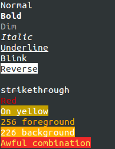
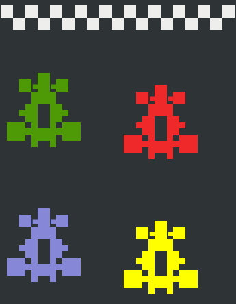
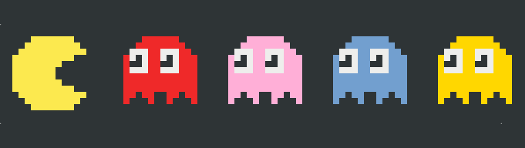
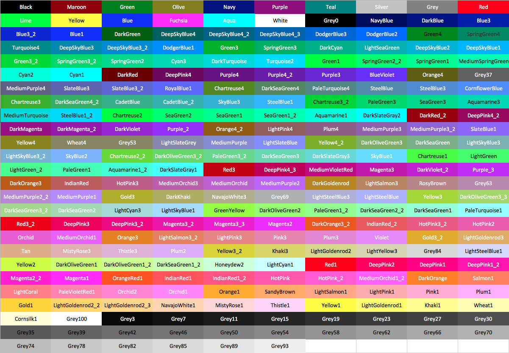

[](https://developer.apple.com/swift/)
[](https://github.com/mtynior/ColorizeSwift/blob/master/LICENSE.md) 
[](https://cocoapods.org/pods/ColorizeSwift)
[](https://github.com/Carthage/Carthage)

Terminal string styling for Swift.

## Requirements

- iOS 9.0+ / Mac OS X 10.10+ / tvOS 9.0+ / watchOS 2.0+
- Xcode 8.0+

## Integration

#### CocoaPods
You can use [CocoaPods](http://cocoapods.org/) to install `ColorizeSwift` by adding it to your `Podfile`:

```ruby
platform :ios, '9.0'
use_frameworks!

target 'MyApp' do
	pod 'ColorizeSwift'
end
```
Run `pods install` to intagrate pods with your project.

#### Carthage
You can use [Carthage](https://github.com/Carthage/Carthage) to install `ColorizeSwift ` by adding it to your `Cartfile`:

```
github "mtynior/ColorizeSwift"
```
Run `carthage update` to build the framework and drag the built `ColorizeSwift.framework` into your Xcode project.

#### Swift Package Managers (SPM)
You can use The [Swift Package Manager](https://swift.org/package-manager/) to install ColorizeSwift by adding it to your Package.swift file:

```swift
import PackageDescription

let package = Package(
    name: "MyApp",
    targets: [],
    dependencies: [
        .Package(url: "https://github.com/mtynior/ColorizeSwift.git", majorVersion: 1)
    ]
)
```

#### Manually
You can also manually add ColorizeSwift to you project:

1. Download `ColorizeSwift.swift` file,
2. Drag `ColorizeSwift.swift` into you project's tree.

## Example
You can run sample application:

1. Open Terminal and go to `Example` folder.
2. Run `./build.sh` script to build sample application.
3. Run `./example pacman` to launch sample.

Available samples:

1. `styles` - prints available styles 

	

2. `f1` - prints F1 cars

	
	
3. `pacman` - prints Pacman

	

4. `mario` - prints mario

	

## Usage
```swift
print("Normal")
print("Bold".bold())
print("Dim".dim())
print("Italic".italic())
print("Underline".underline())
print("Blink".blink())
print("Reverse".reverse())
print("hidden".hidden())
print("strikethrough".strikethrough())
print("Red".red())
print("On yellow".onYellow())
print("256 foreground".foregroundColor(.Orange1))
print("226 background".backgroundColor(.Orange1))
print("Awful combination".colorize(.Yellow, background: .Red))
    
let nested = "with a blue substring".blue().underline()
print("A bold, green line \(nested) that becomes bold and green again".green().bold())
```

## Styles

### Modifiers

- `bold()`
- `dim()`
- `italic()` *(not widely supported)*
- `underline()`
- `reverse()`
- `hidden()`
- `strikethrough()` *(not widely supported)*
- `reset()`

### Foreground colors

- `black()`
- `red()`
- `green()`
- `yellow()`
- `blue()`
- `magenta()`
- `cyan()`
- `lightGray()`
- `darkGray()`
- `lightRed()`
- `lightGreen()`
- `lightYellow()`
- `lightBlue()`
- `lightMagenta()`
- `lightCyan()`
- `white()`

### Background colors

- `onBlack()`
- `onRed()`
- `onGreen()`
- `onYellow()`
- `onBlue()`
- `onMagenta()`
- `onCyan()`
- `onLightGray()`
- `onDarkGray()`
- `onLightRed()`
- `onLightGreen()`
- `onLightYellow()`
- `onLightBlue()`
- `onLightMagenta()`
- `onLightCyan()`
- `onWhite()`


## 256-colors
You can also use 256 colors, but keep in mind that not all Terminal clients support them.

- `foregroundColor(color: TerminalColor)`
- `backgroundColor(color: TerminalColor)`
- `colorize(foreground: TerminalColor, background: TerminalColor)`

#### Available colors

You can access 256 colors using `TerminalColor` enumeration.



## Escape codes
Sometimes you need only open code for a modifier. You can access them using `TerminalStyle` enum:

```swift
TerminalStyle.bold.open // "\u{001B}[1m"
TerminalStyle.bold.close  // "\u{001B}[22m"
```

For 256 colors use:

```swift
TerminalColor.Red.foregroundStyleCode().open \\"\u{001B}[38;5;9m"
TerminalColor.Red.backgroundStyleCode().open \\"\u{001B}[48;5;9m"
```

## Disable

Colorization can be disabled by setting String.isColorizationEnabled to false:

```swift
String.isColorizationEnabled = false
```

For your convenience (and your user's), you can also disable colorization without modifying any code, simply by passing an option (default: --no-color) to the command line:

```
$ ./example --no-color
```

The option is customizable through String.noColorOption:

```swift
String.noColorOption = "--no-color"
String.noColorOption = nil // Disable the option
```


## License

ColorizeSwift is released under the MIT license. See LICENSE for details.
